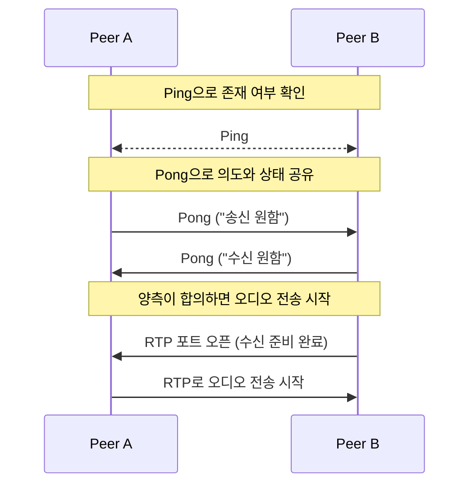

# P2P 오디오 공유 도구

[English](./README.md)

## 소개

간단한 P2P 로컬 오디오 스트리밍 도구입니다.
브로드캐스트 기반의 ping/pong 메시지를 통해 피어를 인식하고, 양측이 전송/수신을 동의하면 RTP(Opus) 스트림이 자동으로 시작됩니다.

주요 특징: 피어는 고유한 ID로 식별됩니다. 따라서 연결이 끊기거나 네트워크 인터페이스를 변경하더라도, 동일한 ID를 재탐색하여 피어를 인식할 수 있으면, 스트리밍/수신을 자동으로 시도합니다.

## Signaling 흐름도



## 빌드

### 사전 준비

- CMake
- C++20을 지원하는 컴파일러(Clang, GCC, MSVC)
- pkg-config
- GStreamer 개발 패키지 (gstreamer-1.0 및 플러그인)

### macOS (Homebrew)

1. 의존성 설치:

```bash
brew install cmake pkg-config gstreamer gst-plugins-base gst-plugins-good
```

2. 설정 및 빌드:

```bash
mkdir build
cd build
cmake -DCMAKE_BUILD_TYPE=Release ..
cmake --build . --config Release
```

### Windows (MSVC)

1. GStreamer 런타임 및 개발 패키지를 공식 사이트에서 설치하세요 (MSVC 빌드와 일치하는 버전).
2. GStreamer의 `pkgconfig` 디렉터리를 가리키도록 `PKG_CONFIG_PATH` 환경 변수를 설정하세요(예시):

```powershell
$env:PKG_CONFIG_PATH = "C:/Program Files/GStreamer/1.0/msvc_x86_64/lib/pkgconfig"
```

3. MSVC를 활용할 수 있는 프롬프트에서 CMake를 실행하고 빌드하세요:

```powershell
mkdir build
cd build
cmake -DCMAKE_BUILD_TYPE=Release ..
cmake --build . --config Release
```

## 서드파티 라이브러리

이 프로젝트는 다음의 서드파티 라이브러리를 사용합니다:

- [JSON for Modern C++](https://github.com/nlohmann/json) — Niels Lohmann. MIT 라이선스.
- [GStreamer](https://gstreamer.freedesktop.org/) — RTP/Opus 미디어 파이프라인에 사용됩니다. LGPL(및 플러그인별 라이선스 차이 있음).
