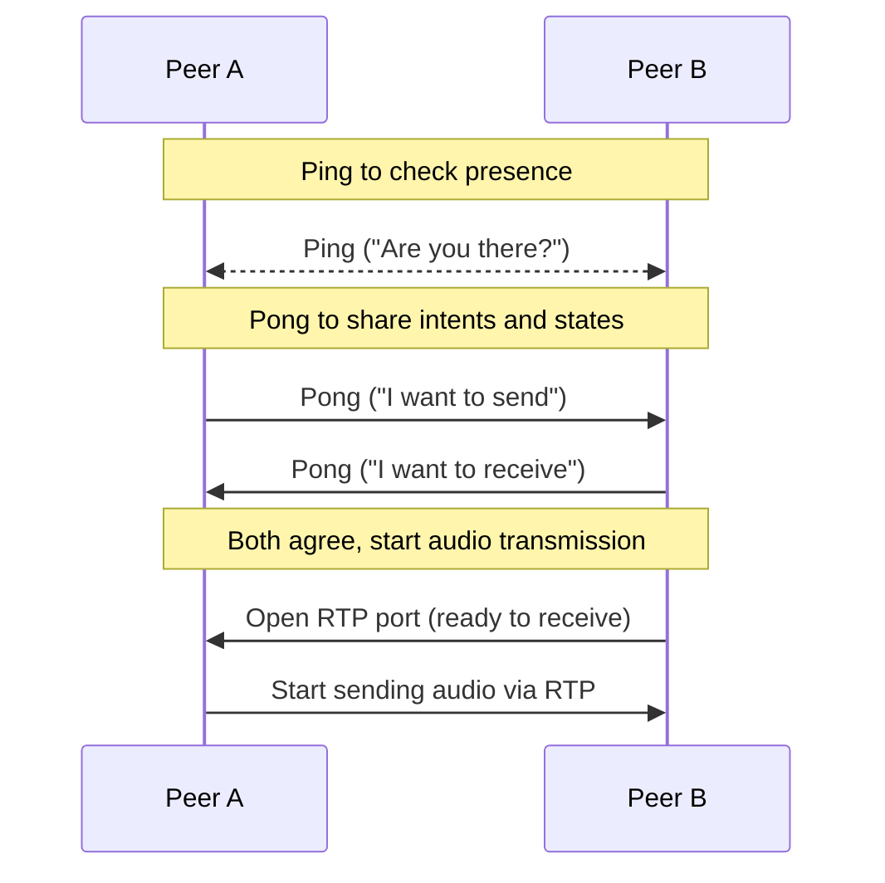

# Audio [가명]

## GStreamer Install

### For Windows

- Go to https://gstreamer.freedesktop.org/download/
- Download and run installers
  - Runtime Installer
  - Development Installer
- Add binary file to system environment variable
  - C:\Program Files\gstreamer\1.0\msvc_x86_64\bin
- Set env
  ```bash
  $env:PKG_CONFIG_PATH="C:/Program Files/GStreamer/1.0/msvc_x86_64/lib/pkgconfig"
  ```

### For Macos

```bash
brew install gstreamer
brew install gst-plugins-base gst-plugins-good
```

### Check

```base
gst-launch-1.0 --version
```

## Signaling flow



## Third-party libraries

This project uses the following third-party libraries:

- [JSON for Modern C++](https://github.com/nlohmann/json) by Niels Lohmann  
  Licensed under the MIT License.
