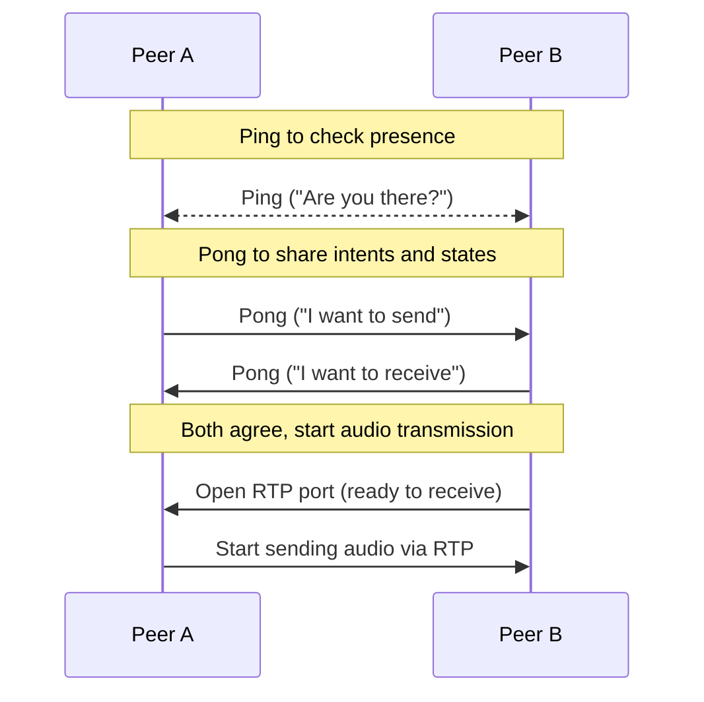

# P2P Audio Sharing Tool

[한국어](./README-kr.md)

## Introduction

A minimal peer-to-peer audio streaming tool for local networks. Peers discover each other via broadcast ping/pong; when both sides agree to send/receive, an RTP (Opus) stream is started automatically.

Notable feature: peers are identified by a peer ID, so if a connection is interrupted or a peer changes network interfaces, the implementation will attempt to re-discover the same peer ID and resume streaming automatically when the peer becomes reachable again.

## Signaling flow



## Build

### Prerequisites

- CMake
- A C++20 capable compiler (Clang, GCC, MSVC)
- pkg-config
- GStreamer development packages (gstreamer-1.0 and plugins) installed on your system

### macOS (Homebrew)

1. Install dependencies:

```bash
brew install cmake pkg-config gstreamer gst-plugins-base gst-plugins-good
```

2. Configure and build:

```bash
mkdir build
cmake -S . -B build -G Xcode
cmake -DCMAKE_BUILD_TYPE=Release .
cmake --build build --config Release
```

### Windows (MSVC)

1. Install GStreamer runtime and development packages from the official site (use the matching MSVC builds).
2. Set the `PKG_CONFIG_PATH` environment variable to point to GStreamer's `pkgconfig` directory, for example:

```powershell
$env:PKG_CONFIG_PATH = "C:/Program Files/GStreamer/1.0/msvc_x86_64/lib/pkgconfig"
```

3. Run CMake from an MSVC command prompt and build

```powershell
mkdir build
cd build
cmake -DCMAKE_BUILD_TYPE=Release ..
cmake --build . --config Release
```

### Android

#### Requirements

- Android NDK (set the `ANDROID_NDK_HOME` environment variable)
- GStreamer Android prebuilt or SDK (set the `GSTREAMER_ROOT_ANDROID` environment variable)
- CMake, Ninja

#### Build commands (PowerShell)

```powershell
cmake -G "Ninja" -S . -B build-android-arm64 `
  -DCMAKE_TOOLCHAIN_FILE="$env:ANDROID_NDK_HOME\build\cmake\android.toolchain.cmake" `
  -DANDROID_ABI="arm64-v8a" `
  -DANDROID_PLATFORM=android-26 `
  -DANDROID_STL=c++_shared `
  -DGSTREAMER_ROOT_ANDROID="$env:GSTREAMER_ROOT_ANDROID" `
  -DCMAKE_BUILD_TYPE=Release

cmake --build build-android-arm64 -- -j 4
```

Notes:

- Example environment variable setup in PowerShell: `$env:ANDROID_NDK_HOME = 'C:\path\to\android-ndk'` and `$env:GSTREAMER_ROOT_ANDROID = 'C:\path\to\gstreamer'`.
- `ANDROID_PLATFORM` is recommended to be at least `android-26`; adjust as needed for your target devices.
- `GSTREAMER_ROOT_ANDROID` should point to a GStreamer Android prebuilt SDK or the root of your Android GStreamer installation.

If you want, I can expand this section with installation links for the NDK and GStreamer Android, or add steps to produce an APK that bundles the native libraries.

## Third-party libraries

This project uses the following third-party libraries:

- [JSON for Modern C++](https://github.com/nlohmann/json) by Niels Lohmann  
  Licensed under the MIT License.
- [GStreamer](https://gstreamer.freedesktop.org/) — used for RTP/Opus media pipelines. Licensed under the LGPL (plugin licenses may vary).
